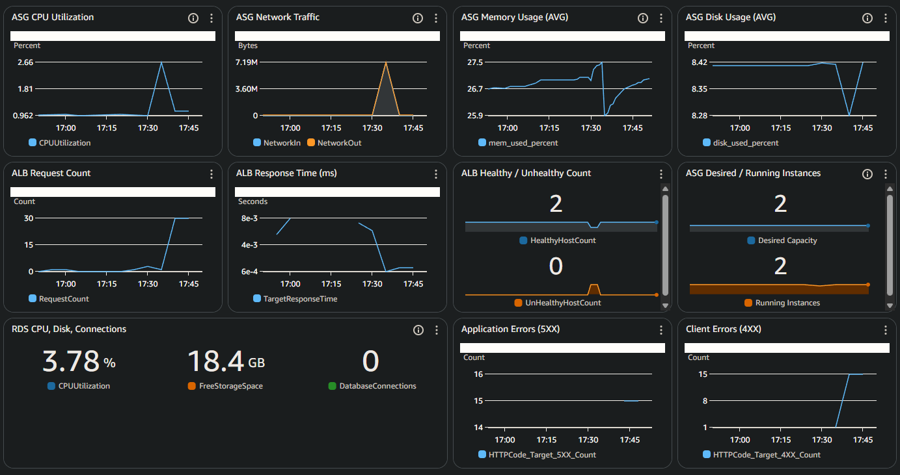

# CloudWatch Monitoring Setup

This document details the **CloudWatch monitoring and alerting setup** for a production-ready three-tier web application.  
It covers dashboard config, custom metrics aggregation via the CloudWatch Agent, and SNS-integrated alarms that validate both system health and automated recovery workflows.

## Dashboard Configuration

**EC2 Metrics (via CloudWatch Agent + ASG)**
- CPU Usage (Idle) - ASG aggregate
- Memory Usage - CloudWatch Agent aggregate
- Disk Usage - CloudWatch Agent aggregate
- Desired vs Running instances - ASG metric

**ALB Metrics**
- Request Count
- Response Time
- Healthy / Unhealthy Targets
- Error counts:
    - 5XX (Application errors)
    - 4XX (Client errors)
- Health check path: /healthcheck.php

**RDS Metrics:**
- CPU Utilization
- Free storage space
- Database connections 



## Alarm Configuration

### Production Alarms

| Alarm Name | Metric | Condition | Period | Severity | SNS Action | Description |
|-------------|---------|------------|----------|------------|--------------|--------------|
| **PROD-P1-RDS-High-CPU** | `CPUUtilization` | ≥ 90% for 2 datapoints | 10 min | P1 – Critical | `webapp-alerts` | Indicates RDS CPU saturation |
| **PROD-P1-RDS-Low-Storage** | `FreeStorageSpace` | < 2 GB for 2 datapoints | 15 min | P1 – Critical | `webapp-alerts` | Database storage running low |
| **PROD-P2-EC2-High-Disk-Usage** | `disk_used_percent` | ≥ 85% for 1 datapoint | 1 min | P2 – High | `webapp-alerts` | Disk utilization approaching full |
| **PROD-P2-Single-Instance-Unhealthy** | `UnHealthyHostCount` | ≥ 1 for 3 datapoints | 3 min | P2 – High | `webapp-alerts` | One target in ALB target group unhealthy |
| **PROD-P1-All-Instances-Unhealthy** | `UnHealthyHostCount` | ≥ 2 for 2 datapoints | 2 min | P1 – Critical | `webapp-alerts` | All instances unhealthy – application outage |
| **PROD-P2-High-Error-Rate** | `HTTPCode_Target_5XX_Count` | ≥ 10 for 1 datapoint | 5 min | P2 – High | `webapp-alerts` | Elevated server-side error rate detected |

## Alarm Validation

### 1. Target Group Health Alarms

**Objective:** Verify automatic alerting when application instances become unhealthy.

**Test Steps:**
```bash
# Stop Apache service on one instance
sudo systemctl stop httpd
```
- Target group reported 1 unhealthy host → PROD-P2-Single-Instance-Unhealthy alarm triggered.
- ASG automatically replaced instance → Target group returned to healthy → Alarm returned to OK.
- Restarted Apache service to confirm recovery.
**Result**: SNS alert received, system auto-recovered.

### 2. Application Error Rate Alarm

**Objective:** Validate ALB 5XX detection and alarm accuracy.

**Test Steps:**
```bash
# Create a temporary PHP file to force 500 errors
echo "<?php http_response_code(500); ?>" | sudo tee /var/www/html/test500.php

# Generate 30 requests
for i in {1..30}; do 
  curl -s -o /dev/null -w "%{http_code}\n" http://webapp-alb-1270271488.us-east-1.elb.amazonaws.com/test500.php
done
```


- Multiple 500 codes observed in output.
- Within ~5 minutes, PROD-P2-High-Error-Rate alarm transitioned to In Alarm.
- SNS notification confirmed trigger.
- **Result:** Alarm triggered and recovered correctly when file restored.

## Notes
- Dashboard visualizes ASG-level CPU and network performance.
- Memory/Disk metrics are reported through CloudWatch Agent and aggregated by the `AutoScalingGroupName` dimension.
- Alarms configured to treat missing data as not breaching to prevent false alarms during scaling or restarts.
- Health check path `/healthcheck.php` isolates status checks from user-facing application logic.