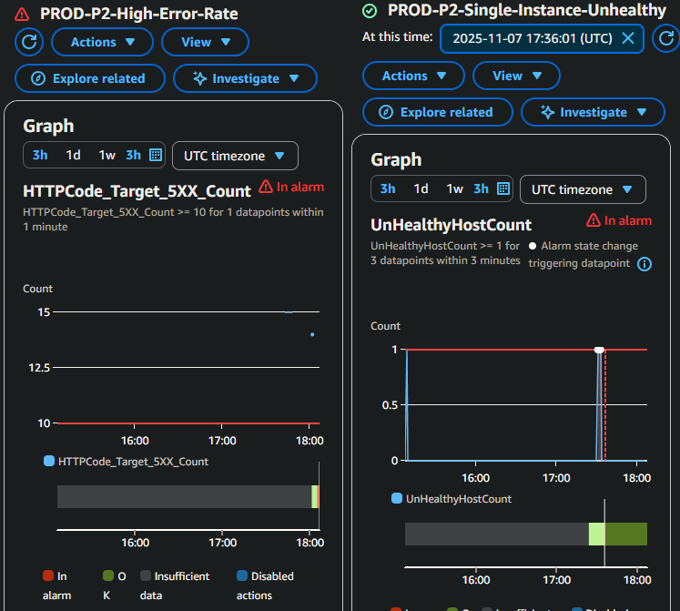

# CloudWatch Monitoring Setup

This document outlines the **CloudWatch monitoring and alerting configuration** for the AWS 3-tier web application.  
It explains how dashboards, custom metrics, and alarms were built to track infrastructure health and automatically notify through SNS.

## Dashboard Configuration

**EC2 Metrics (via CloudWatch Agent + ASG)**
- CPU Usage (Idle) – aggregated by Auto Scaling Group
- Memory Usage – aggregated via CloudWatch Agent
- Disk Usage – aggregated via CloudWatch Agent
- Desired vs Running Instances – ASG metric

**ALB Metrics**
- Request Count
- Response Time
- Healthy / Unhealthy Targets
- Error Rates:
    - 5XX - Application errors
    - 4XX - Client errors
- Health Check Path: `/healthcheck.php`

**RDS Metrics:**
- CPU Utilization
- Free storage space
- Database connections 


## Alarm Configuration

### Production Alarms

| Alarm Name | Metric | Condition | Period | Severity | SNS Action | Description |
|-------------|---------|------------|----------|------------|--------------|--------------|
| **RDS-High-CPU** | `CPUUtilization` | ≥ 90% for 2 datapoints | 10 min | Critical | `webapp-alerts` | Indicates RDS CPU saturation |
| **RDS-Low-Storage** | `FreeStorageSpace` | < 2 GB for 2 datapoints | 15 min | Critical | `webapp-alerts` | Database storage running low |
| **EC2-High-Disk-Usage** | `disk_used_percent` | ≥ 85% for 1 datapoint | 1 min | High | `webapp-alerts` | Disk utilization approaching full |
| **ASG-Single-Instance-Unhealthy** | `UnHealthyHostCount` | ≥ 1 for 3 datapoints | 3 min | High | `webapp-alerts` | One ALB target unhealthy |
| **ASG-All-Instances-Unhealthy** | `UnHealthyHostCount` | ≥ 2 for 2 datapoints | 2 min | Critical | `webapp-alerts` | All instances unhealthy (app outage) |
| **ALB-High-Error-Rate** | `HTTPCode_Target_5XX_Count` | ≥ 10 for 1 datapoint | 5 min | High | `webapp-alerts` | Elevated server-side error rate |

## Alarm Validation

### 1. Target Group Health Alarms

**Goal:** Confirm alert triggers when instances become unhealthy.

**Test Steps:**
```bash
# Stop Apache service on one instance
sudo systemctl stop httpd
```
- Target group showed 1 unhealthy host → **ASG-Single-Instance-Unhealthy** alarm triggered.
- Auto Scaling Group launched replacement instance
- Alarm reset to OK after recovery

**Result:** SNS notification received, instance replaced successfully.

### 2. Application Error Rate Alarm

**Goal:** Validate ALB 5XX error detection.

**Test Steps:**
```bash
# Create a temporary PHP file to force 500 errors
echo "<?php http_response_code(500); ?>" | sudo tee /var/www/html/test500.php

# Generate 30 requests
for i in {1..30}; do 
  curl -s -o /dev/null -w "%{http_code}\n" http://webapp-alb-1270271488.us-east-1.elb.amazonaws.com/test500.php
done
```
- Multiple 500 responses confirmed in output.
- After ~5 minutes, **ALB-High-Error-Rate** alarm entered *In Alarm* state.
- SNS email alert received
**Result:** Alarm triggered as expected and cleared after file removal.



## Notes
- Dashboard visualizes ASG-level CPU and network metrics automatically
- Memory/Disk metrics aggregated via the AutoScalingGroupName dimension in the CloudWatch Agent config
- Alarms configured to treat missing data as not breaching to prevent false positives during scaling
-  All alarms verified to send email notifications via the `webapp-alerts` SNS topic
- `/healthcheck.php` isolates ELB checks from app logic to reduce false failures

## Improvements to Explore
- Add custom namespace for CloudWatch Agent metrics
- Configure composite alarms for grouped incident alerts
- Integrate alarms with Lambda for auto-remediation
- Extend runbooks for automated scaling event response