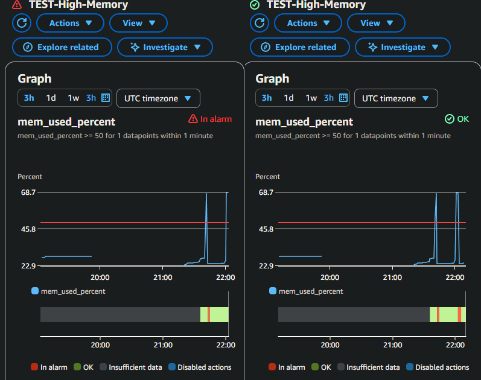

# CloudWatch Monitoring Setup

## Dashboard Configuration

**EC2 Metrics (via CloudWatch Agent + ASG)**
- CPU Usage (Idle) - ASG aggregate
- Memory Usage - CloudWatch Agent aggregate
- Disk Usage - CloudWatch Agent aggregate
- Desired vs Running instances - ASG metric

**ALB Metrics**
- Request Count
- Response Time
- Healthy / Unhealthy Targets
- Error counts:
    - 5XX (Application errors)
    - 4XX (Client errors)
- Health check path: /healthcheck.php

**RDS Metrics:**
- CPU Utilization
- Free storage space
- Database connections 

## Alarm Configuration and Testing

**Test Alarm**
- Metric: Memory Usage (mem_used_percent)
- Threshold >= 50% for 1 datapoint within 1 minute
- Action: SNS topic (webapp-alerts) -> Email notification
- Test with `stress-ng --vm 1 --vm-bytes 400M --timeout 120s`

**Results:**
- Memory usage spiked to 68%
- Alarm triggered and SNS email received
- Alarm states: OK -> In alarm -> OK

## Production Alarms

**RDS High CPU**
- Threshold: >= 90% for 2 consecutive periods (5 minutes)
- Action: `webapp-alerts` SNS

**RDS Low Storage**
- Threshold: <= 2,000,000,000 (2 GB in bytes) for 2 datapoints within 15 minutes
- Action: `webapp-alerts` SNS 

**EC2 High Disk Usage**
- Condition: >= 85% (`disk_used_percent`)
- Action: webapp-alerts SNS

## Notes
- Dashboard shows ASG-level metrics for CPU and network
- Memory/Disk metrics are aggregated across all instances in the ASG using the CloudWatch Agent (`AutoScalingGroupName` dimension)
- When new instances are launched, metrics automatically roll up into the ASG-level view
- ALB health check path is `/healthcheck.php` to avoid 500 errors