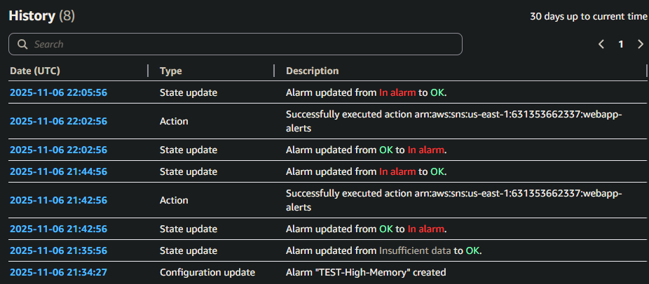

# CloudWatch Monitoring Setup

## Dashboard Configuration

**EC2 Metrics:**
- CPU Usage (Idle) - tracking CPU availability
- Memory Usage - percentage of RAM utilized
- Root Disk Usage - filesystem capacity monitoring

**RDS Metrics:**
- CPU Utilization - database processing load
- Free storage space - available disk capacity
- Database connections - active connection count


## Alarm Configuration and Testing

**Test Alarm Created:**
- Metric: Memory Usage (mem_used_percent)
- Threshold >= 50% for 1 datapoint within 1 minute
- Action: SNS topic (webapp-alerts) -> Email notification
- State: Configured and verified

**Testing Process:**
```bash
# Generated memory usage with stress-ng
stress-ng --vm 1 --vm-bytes 400M --timeout 120s
```

**Results:**
- Memory usage spiked to 68%
- Alarm triggered successfully 
- SNS Email notification received within 1-2 minutes
- Alarm state transitioned: OK -> In alarm -> OK





**Lessons Learned:**
- Cloudwatch agent metrics have ~1 minute collection interval
- Make sure dashboard widget collection period is set to 1min
- Email delivery is reliable and was able to have the notification pushed from gmail to my phone

## Production Alarms

**Alarm 1: RDS High CPU**

- Name: PROD-P1-RDS-High-CPU
- Description: Database CPU critically high, queries may be slow
- Metric: RDS CPUUtilization
- Threshold: >= 90% for 2 consecutive periods (5 minutes)
- Action: webapp-alerts SNS topic

**Alarm 2: RDS Low Storage**

- Name: PROD-P1-RDS-Low-Storage
- Description: Database running out of disk space
- Metric: RDS FreeStorageSpace
- Threshold: <= 2,000,000,000 (2 GB in bytes) for 2 datapoints within 15 minutes
- Action: webapp-alerts SNS topic

**Alarm 3: EC2 High Disk Usage**
- Name: PROD-P2-EC2-High-Disk
- Description: Instance disk usage high, may impact application
- Metric: CWAgent disk_used_percent
- Condition: >= 85% 
- Action: webapp-alerts SNS topic


