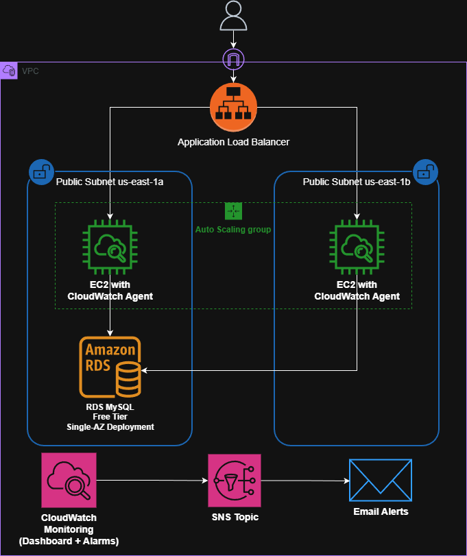

# AWS CloudWatch Monitoring System
Hands-on AWS project demonstrating how to design, deploy, and monitor a 3-tier web application using EC2, RDS, ALB, and CloudWatch

This setup simulates a production-style environment with automated alerts, health checks, and incident runbooks, built entirely within the AWS Free Tier.

---

## Architecture


Components:
- Multi-AZ VPC (2 public + 2 private subnets)
- Application Load Balancer distributing HTTP traffic
- Auto Scaling Group (2–4 EC2 web servers)
- RDS MySQL database
- CloudWatch for metrics, logs, and alarms
- SNS topic for email notifications
> **Design Note:** 
> All resources deployed in public subnets to avoid NAT Gateway costs (for learning).
In production, EC2 and RDS would be private with NAT access.
--- 
## Monitoring Highlights

- **EC2 Metrics:** CPU, memory, disk via CloudWatch Agent
- **ALB Metrics:** Request count, latency, 4XX/5XX errors, target health
- **RDS Metrics:** CPU utilization, connections, free storage
- **SNS Alerts:** Email notifications for all alarms

**Sample Alarms**

| Alarm	| Type | Trigger |
|-------|------|---------| 
|RDS High CPU | Critical | CPU ≥ 90% (10 min) |
|EC2 High Disk | High | Disk ≥ 85% |
|Single Instance Unhealthy | High | ≥ 1 target failing |
|All Instances Unhealthy | Critical	| ≥ 2 targets failing |
|High 5XX Error Rate | High | ≥ 10 errors in 5 min |

## Key Learnings

- Debugging user-data scripts and RDS connectivity
- Aggregating instance metrics at the ASG level
- Building CloudWatch dashboards and SNS alerts
- Testing alarm conditions and interpreting CloudWatch logs
- Understanding how ALB health checks affect instance replacement

## Next Steps

- Add Route 53 for custom DNS
- Move compute/database to private subnets
- Automate setup with Terraform
- Add Lambda auto-remediation for failed health checks

## Repo Structure
```
aws-cloudwatch-monitoring/
├── README.md
├── DEPLOYMENT.md
├── MONITORING.md
├── runbooks/
├── scripts/
└── screenshots/
```

## Key Configuration Details

### EC2

- AMI: Amazon Linux 2023 (x86_64)
- Instance type: t3.micro
- User Data installs Apache, PHP, and CloudWatch Agent
- Waits for RDS connectivity using `mariadb105`
- Publishes ASG-level metrics via `AutoScalingGroupName`
- Tags: `Name: webapp-asg-instance`,`Environment: dev`, `Project: cloudwatch-monitoring`

### RDS
- MySQL 8.0.42
- db.t3.micro, 20GB gp2
- Single-AZ deployment
- Security group allows port 3306 only from EC2 SG

### ALB & Target Group

- Internet-facing ALB on port 80
- Health check path: `/healthcheck.php` (lightweight, no DB dependency)
- Listener forwards traffic to `webapp-tg`
- 2 healthy targets managed by ASG

### Auto Scaling Group

- Desired: 2  Min: 2  Max: 4
- Health check type: ELB
- Grace period: 300 seconds

--- 

**EC2 Launch Template**
- AMI: Amazon Linux 2023 640bit
- Instance type: t3.micro
- Storage: 8GB gp3 storage (encrypted)
- Security group: webapp-ec2-sg
    - Inbound: HTTP 80 from ALB SG only, SSH from your IP
- Auto-assign IPv4 address
- IAM role: CloudWatchAgentServerPolicy + AmazonSSMManagedInstanceCore
- [User Data:](scripts/user-data-full-config.sh)
    - Apache, PHP, CloudWatch Agent
    - Wait RDS RDS connectivity (`mariadb105`)
    - CloudWatch agent configured with `AutoScalingGroupName` for ASG-level aggregation
    - PHP files created and permissions set
- Tags: Name: webapp-instance, Environment: dev, Project: cloudwatch-monitoring

--- 

**Application Load Balancer**
- Name: webapp-alb
- Internet facing
- Subnets: us-east-1a/b
- Security Group: `webapp-alb-sg` (HTTP from anywhere)
- Listener: HTTP 80 -> webapp-tg
- DNS: webapp-alb-1270271488.us-east-1.elb.amazonaws.com

--- 

**Target Group**
- Name: webapp-tg
- Protocol: HTTP(80)
- Health check path: `/healthcheck.php`
- Healthy/Unhealthy Threshold: 2
- Targets: EC2 instances in ASG
- **Note:** Lightweight health check avoids DB-dependent failures.

---

**Auto Scaling Group**
- Name: webapp-asg
- Launch Template: webapp-lt (latest version)
- Subnets: public subnets
- Desired: 2, Min: 2, Max: 4
- Health check type: ELB
- Grace period: 300s

---

**Security Architecture:**
- EC2 only allows HTTP from ALB SG
- No direct internet access
- All traffic flows through ALB


---

**Testing**

```bash
# Verify load balancing
for i in {1..10}; do curl webapp-alb-1270271488.us-east-1.elb.amazonaws.com; done

# Expected output distributed across instances
Status: OK
Server: ip-10-0-31-184.ec2.internal
Database: Connected
Time: 2025-11-07 02:21:50
```

---

**Troubleshooting Notes:**
- Initial instances failed health checks due to RDS connectivity check in user data
- Issue: User data waited for RDS to be reachable, but timed out before creating index.php
- Solution: Added mariadb105 package to user data for MySQL client to allow RDS connectivity verification
- Old instances terminated, ASG launched healthy replacements
- CloudWatch Agent now includes ASG dimension for future aggregation

