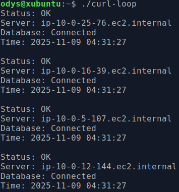
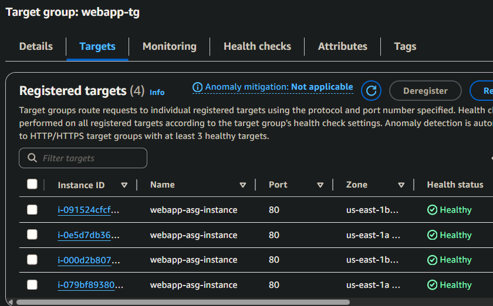
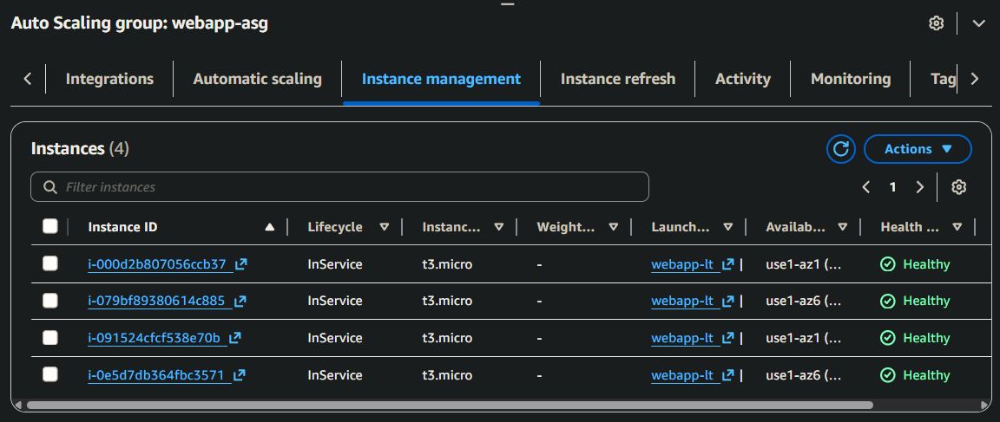

# AWS CloudWatch Monitoring System
Hands-on AWS project demonstrating how to design, deploy, and monitor a 3-tier web application using EC2, RDS, ALB, and CloudWatch
This setup simulates a production-style environment with automated alerts, health checks, and incident runbooks, built entirely within the AWS Free Tier.

>To explore: Start with [README.md](README.md) → then [DEPLOYMENT.md](DEPLOYMENT.md) → then [MONITORING.md](MONITORING.md) → finally, view [runbooks/](runbooks) for troubleshooting examples.

## Architecture


| Layer | Technology |
|-------|-------- |
| Compute    | EC2 (Amazon Linux 2023) |
| Database   | RDS MySQL |
| Networking | VPC, ALB, SG |
| Monitoring | CloudWatch, SNS |
| Scripting  | Bash (user data) |

> **Design Note:** 
> All resources deployed in public subnets to avoid NAT Gateway costs (for learning).
> In production, EC2 and RDS would be private with NAT access.

For complete setup and configuration details, see [DEPLOYMENT.md](DEPLOYMENT.md)

--- 
## Monitoring Highlights

- **EC2 Metrics:** CPU, memory, disk via CloudWatch Agent
- **ALB Metrics:** Request count, latency, 4XX/5XX errors, target health
- **RDS Metrics:** CPU utilization, connections, free storage
- **SNS Alerts:** Email notifications for all alarms

**Sample Alarms**

| Alarm	| Type | Trigger |
|-------|------|---------| 
|RDS High CPU | Critical | CPU ≥ 90% (10 min) |
|EC2 High Disk | High | Disk ≥ 85% |
|Single Instance Unhealthy | High | ≥ 1 target failing |
|All Instances Unhealthy | Critical	| ≥ 2 targets failing |
|High 5XX Error Rate | High | ≥ 10 errors in 5 min |

## Verification

**Load Balancer Distributing Traffic:**



**Healthy Targets:**



**Auto Scaling Group:**



All components operational and monitored via CloudWatch dashboard (see [MONITORING.md](MONITORING.md))

## Key Learnings

- Debugging user-data scripts and RDS connectivity
- Aggregating instance metrics at the ASG level
- Building CloudWatch dashboards and SNS alerts
- Testing alarm conditions and interpreting CloudWatch logs
- Understanding how ALB health checks affect instance replacement

## Validation & Troubleshooting
- Load balancing verified — requests distributed evenly across instances
- RDS connection confirmed from web layer
- Health checks stable using `/healthcheck.php`
- See [DEPLOYMENT.md](DEPLOYMENT.md) for testing and troubleshooting details

## Next Steps

- Add Route 53 for custom DNS
- Move compute/database to private subnets
- Automate setup with Terraform
- Add Lambda auto-remediation for failed health checks

## Repo Structure
```
aws-cloudwatch-monitoring/
├── README.md
├── DEPLOYMENT.md
├── MONITORING.md
├── runbooks/
├── scripts/
└── screenshots/
```