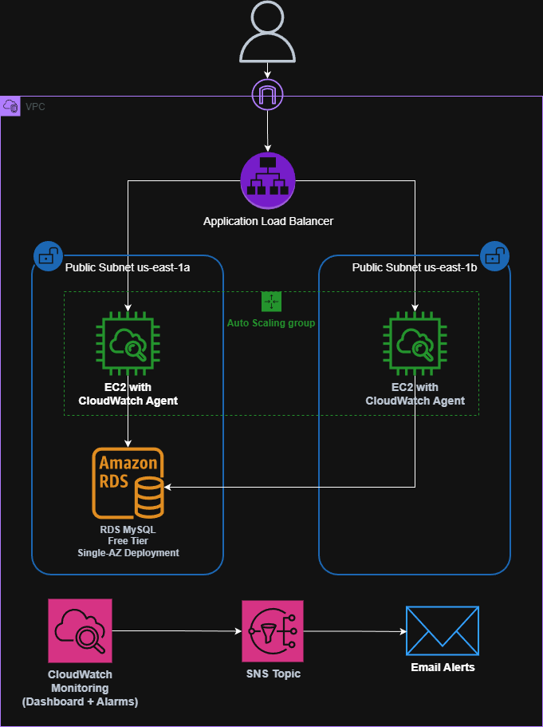
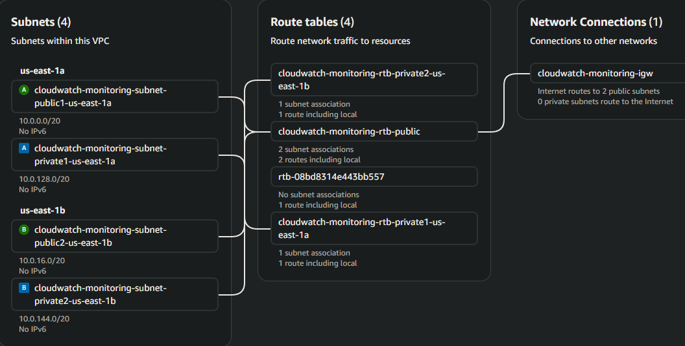
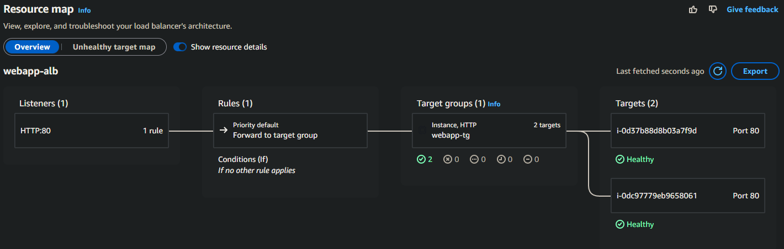

# aws-cloudwatch-monitoring
CloudWatch monitoring solution for a 3-tier web application

--- 

**VPC**
- VPC CIDR: 10.0.0.0/16
- Availability Zones: 2 (us-east-1a, us-east-1b)
- Public subnets: 10.0.0.0/20, 10.0.16.0/20
- Private subnets: 10.0.128.0/20, 10.0.144.0/20
- NAT Gateways: 0 (keeping costs down for learning project)
- 1 Internet Gateway attached to VPC
- 1 Public Route Table with IGW route (0.0.0.0/0 -> igw)
- 2 Private route tables (one per AZ)
- Public subnets associated with public route table
- Private subnets associated with respective private route table


- **Design Choice:** Used public subnets for all resources initially to avoid NAT Gateway costs. In production, EC2 and RDS would go in the private subnets with NAT for internet access. The current setup is secure enough for a monitoring project since RDS won't be public and EC2 security groups will be restrictive.

--- 

**RDS**
- MySQL 8.0.42, db.t3.micro, 20GB gp2, Single AZ
- Security Group: webapp-rds-sg
    - Inbound:  MYSQL/Aurora:3306(webapp-ec2-sg)

--- 

**EC2 Launch Template**
- AMI: Amazon Linux 2023 640bit
- Instance type: t3.micro
- Storage: 8GB gp3 storage (encrypted)
- Security group: webapp-ec2-sg
    - Inbound: HTTP 80 from ALB SG only, SSH from your IP
- Auto-assign IPv4 address
- IAM role: CloudWatchAgentServerPolicy + AmazonSSMManagedInstanceCore
- [User Data:](scripts/user-data-full-config.sh)
    - Apache, PHP, CloudWatch Agent
    - Wait RDS RDS connectivity (`mariadb105`)
    - CloudWatch agent configured with `AutoScalingGroupName` for ASG-level aggregation
    - PHP files created and permissions set
- Tags: Name: webapp-instance, Environment: dev, Project: cloudwatch-monitoring

--- 

**Application Load Balancer**
- Name: webapp-alb
- Internet facing
- Subnets: us-east-1a/b
- Security Group: `webapp-alb-sg` (HTTP from anywhere)
- Listener: HTTP 80 -> webapp-tg
- DNS: webapp-alb-1270271488.us-east-1.elb.amazonaws.com

--- 

**Target Group**
- Name: webapp-tg
- Protocol: HTTP(80)
- Health check path: `/healthcheck.php`
- Healthy/Unhealthy Threshold: 2
- Targets: EC2 instances in ASG
- **Note:** Lightweight health check avoids DB-dependent failures.

---

**Auto Scaling Group**
- Name: webapp-asg
- Launch Template: webapp-lt (latest version)
- Subnets: public subnets
- Desired: 2, Min: 2, Max: 4
- Health check type: ELB
- Grace period: 300s

---

**Security Architecture:**
- EC2 only allows HTTP from ALB SG
- No direct internet access
- All traffic flows through ALB



---

**Testing**

```bash
# Verify load balancing
for i in {1..10}; do curl webapp-alb-1270271488.us-east-1.elb.amazonaws.com; done

# Expected output distributed across instances
Status: OK
Server: ip-10-0-31-184.ec2.internal
Database: Connected
Time: 2025-11-07 02:21:50
```

---

**Troubleshooting Notes:**
- Initial instances failed health checks due to RDS connectivity check in user data
- Issue: User data waited for RDS to be reachable, but timed out before creating index.php
- Solution: Added mariadb105 package to user data for MySQL client to allow RDS connectivity verification
- Old instances terminated, ASG launched healthy replacements
- CloudWatch Agent now includes ASG dimension for future aggregation

